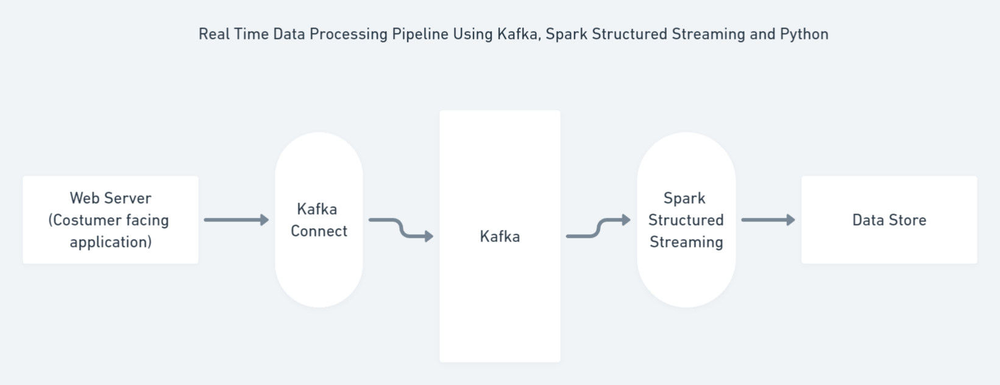

## Real Time Data Pipeline

This repository contains data pipeline architecture, code 
and test scripts of building real time data piplines.

#### Technology Stack
* Kafka
* Spark Structured Streaming
* Databricks
* AWS
* Python 3+

#### Architecture

#### Steps to Navigate and Consume the repository code for own perusal.

TODO

aws cloudformation package --template-file master.yaml --output-template-file temp-template.templat
e --region ap-south-1 --s3-bucket aws-lab-real-time-datapipeline

aws cloudformation deploy --template-file C:\Users\Aditya\PycharmProjects\real-time-data-pipeline\t
emp-template.template --stack-name real-time-datapipeline

### Setting Up Web Server Logs Simulator

We will be setting up a web server logs simulator to generate ecommerce
website logs in the real time which we can use to build our
real time pipeline.

* Have EC2 instance up and running (I am using cloudformation to do so, same template is attached in repo)
* Install GIT `sudo yum -y install git`
* Install given repo, which has code of simulator [credit to itversity] `git clone https://github.com/dgadiraju/gen-logs-python3.git`
* Install Python3 `sudo yum -y install python3`
* Move folder gen-logs-python3/gen_logs to /opt `sudo mv -f gen-logs-python3/gen_logs /opt`
* Change ownership of folder /opt/gen_logs `sudo chown -R ec2-user:ec2-user /opt/gen_logs`
* Update Path `export PATH=$PATH:/opt/gen_logs`
* Run `start_logs.sh`
* Validate by running `tail_logs.sh`, you should have real time logs simulating.

### Setting Up Kafka and Zookeper

* Install `sudo yum -y install wget`
* Install JAVA `sudo yum -y install java-1.8.0-openjdk`
* Download Kafka `wget https://dlcdn.apache.org/kafka/2.7.1/kafka_2.12-2.7.1.tgz`
* Unzip Kafka `tar -xzf kafka_2.12-2.7.1.tgz`
* `vi .bashrc`
* `export KAFKA_HEAP_OPTS="-Xmx500M -Xms500M"`
* `source .bashrc`
* `cd kafka_2.12-2.7.1/ `
* ` nohup bin/zookeeper-server-start.sh config/zookeeper.properties > ~/zookeeper-logs &`
* Use `ctrl+d` to exit from the instance
* Relogin and validate if zookeeper is running using `telnet localhost 2181`
* `cd kafka_2.12-2.7.1/ `
* `nohup bin/kafka-server-start.sh config/server.properties > ~/kafka-logs &`
* Use `ctrl+d` to exit from the instance
* Relogin and validate if kafka is running using `telnet localhost 9092`

Credit to Dzone article for kafka installation [https://dzone.com/articles/installing-and-running-kafka-on-an-aws-instance]

#### Kafka Commands
